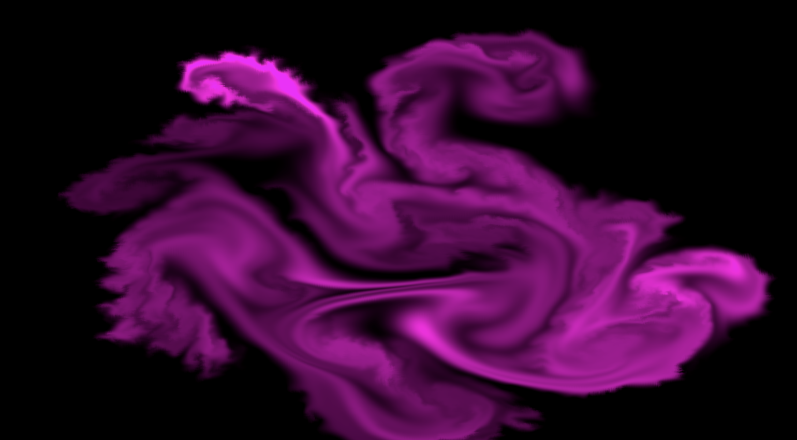

# 🌀 2D Fluid Demo

A real-time 2D fluid simulation written in Unity using fragment shaders (Blit-based), inspired by [PavelDoGreat/WebGL-Fluid-Simulation](https://github.com/PavelDoGreat/WebGL-Fluid-Simulation).

This project implements a simplified yet physically-grounded fluid solver in screen space, supporting dye injection, velocity advection, incompressibility enforcement, and vorticity confinement.

---

## 🚀 Features

* 💧 **Real-time 2D fluid dynamics** (Eulerian grid-based)
* 🎨 **Mouse-driven dye and velocity injection** (splatting)
* 🌀 **Vorticity confinement** to enhance visual swirls
* 💨 **Velocity and dye advection** via semi-Lagrangian scheme
* 🧮 **Incompressibility enforcement** via iterative pressure solve
* 🎞️ **Dissipation control** for dye and velocity fading
* 🧪 Fully GPU-based, implemented in fragment shaders

---

## 📐 Physical Principles

This demo follows standard grid-based fluid simulation principles outlined in **Jos Stam's "Stable Fluids"** model:

### 1. **Advection**

Transports quantities (velocity, dye) along the velocity field:

$$
q(\mathbf{x}, t + \Delta t) = q(\mathbf{x} - \mathbf{v} \Delta t, t) \cdot \text{dissipation}
$$

### 2. **Incompressibility**

Enforces zero divergence of the velocity field via pressure projection:

$$
\nabla \cdot \mathbf{v} = 0 \quad \Rightarrow \quad \mathbf{v} \gets \mathbf{v} - \nabla p
$$

### 3. **Pressure Solve**

Solves the Poisson equation iteratively:

$$
\nabla^2 p = \nabla \cdot \mathbf{v}
$$

### 4. **Vorticity Confinement**

Reintroduces fine swirling motion lost due to dissipation:

$$
\mathbf{f}_\omega = \epsilon (\nabla |\omega| \times \hat{\omega})
$$

Where `ω` is the scalar curl, and `ε` is the curl strength parameter.

### 5. **Splatting (Impulse Injection)**

Injects velocity and dye based on mouse position and drag delta using Gaussian falloff.

---

## 🧱 Shader Modules

| Shader                    | Purpose                                        |
| ------------------------- | ---------------------------------------------- |
| `Advection.shader`        | Advect velocity or dye based on velocity field |
| `Divergence.shader`       | Compute divergence of velocity                 |
| `Pressure.shader`         | Solve pressure iteratively                     |
| `GradientSubtract.shader` | Project velocity to incompressible field       |
| `SplatDye.shader`         | Inject dye at mouse position                   |
| `SplatVelocity.shader`    | Inject velocity impulse                        |
| `Vorticity.shader`        | Compute curl of velocity                       |
| `VorticityForce.shader`   | Add swirl force to velocity                    |
| `Display.shader`          | Render final dye texture                       |

---

## 🕹️ Controls

* **Left Click + Drag**: Injects dye and velocity (directional)
* **Hold**: Continuous injection
* **Adjust parameters** in `FluidSim.cs` for tuning radius, viscosity, etc.

---

## 🛠️ Dependencies

* Unity 6

---

## 📁 Project Structure

```
Assets/
├── Shaders/              # All simulation shaders
├── Scripts/
│   └── FluidSim.cs       # Main simulation logic
```

---

## 🎛️ Parameters & Tips

你可以在 Unity Inspector 中实时调整以下参数以控制模拟行为：

#### 🧪 Simulation Settings

| Parameter            | Description                                                              |
| -------------------- | ------------------------------------------------------------------------ |
| `simResolution`      | Resolution of the simulation grid (higher = more detail, more expensive) |
| `pressureIterations` | Number of Gauss-Seidel iterations for pressure solve (incompressibility) |
| `deltaTimeMin/Max`   | Clamped delta time per frame, helps ensure numerical stability           |
| `velocityMultiplier` | Scales the strength of injected velocity from mouse drag                 |
| `viscosity`          | Controls how quickly the velocity field dissipates over time             |
| `decay`              | Controls how quickly dye fades over time (0 = never fade)                |

#### 🎨 Splat Settings

| Parameter       | Description                                                               |
| --------------- | ------------------------------------------------------------------------- |
| `splatRadius`   | Radius of mouse splat for both dye and velocity injection (in UV units)   |
| `splatDyeColor` | Color of injected dye (can be customized to simulate different materials) |

#### 🌀 Vorticity Settings

| Parameter      | Description                                                         |
| -------------- | ------------------------------------------------------------------- |
| `curlStrength` | Controls how strongly vorticity force reintroduces swirling motions |

> 💡 **Tip**: If you feel the dye stays static, try increasing `velocityMultiplier`, `curlStrength` or reducing `viscosity`.

---

## 📖 References

* [Stable Fluids by Jos Stam (1999)](https://www.dgp.toronto.edu/public_user/stam/reality/Research/pdf/GDC03.pdf)
* [WebGL Fluid Simulation by PavelDoGreat](https://github.com/PavelDoGreat/WebGL-Fluid-Simulation)
* Bridson, R. (2015). *Fluid Simulation for Computer Graphics*

---

### 🧠 TODO

* [ ] Add GUI sliders for parameters
* [ ] Optimize with compute shaders
* [ ] Add obstacles / boundary conditions
* [ ] GPU-based multi-resolution support

---

### 📸 Preview


*Swirling flow induced by directional dye injection with vorticity confinement*

---

### 📜 License

MIT License – free to use, modify and share.
